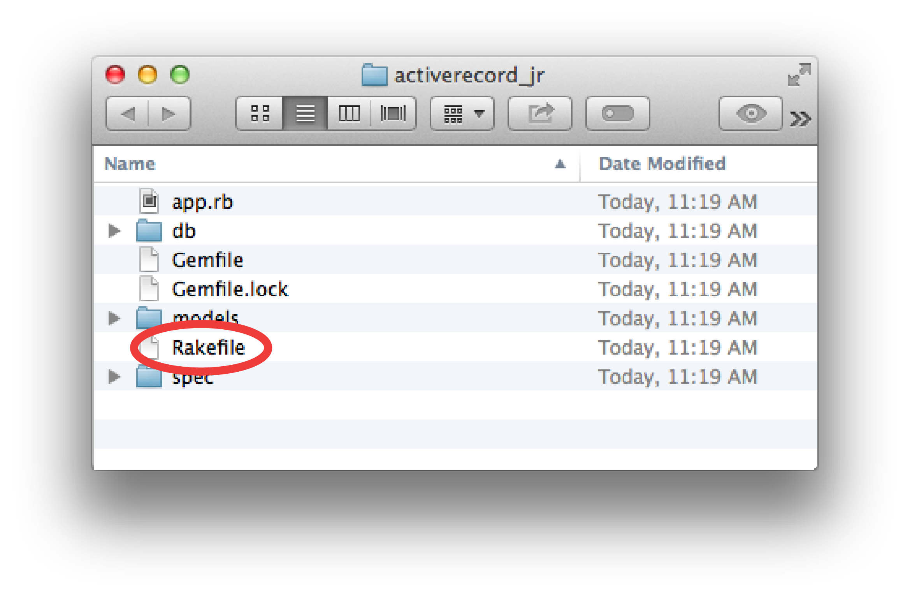
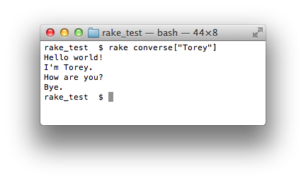

# Rake
Written by [Torey Hickman](https://github.com/toreyhickman).

## Introduction

[Rake](http://rubygems.org/gems/rake) is a Ruby gem that allows us to automate repetitive tasks.  One of the use cases for Rake is to build files of one type out of files of another type—if you read up on Rake, you'll probably see it refered to as a [build tool](http://en.wikipedia.org/wiki/Build_automation).  For example, I have a website, and I write the content in [Markdown](http://en.wikipedia.org/wiki/Markdown).  However, I need those markdown files (.md or .markdown) to be converted to HTML before uploading them to the Web.  I could write a Rake task to convert any new or updated .md files into .html files—[Avdi Grimm](https://twitter.com/avdi) has a series of [screencasts demonstrating this](https://github.com/jimweirich/rake#presentations-and-articles-about-rake)—and upload them.

You can also use Rake for scripting any Ruby code that you'd like to run—just write a task for it.  You'll be using Rake at the end of Phase 1 and throughout Phases 2 and 3.  You'll be using Rake primarily to set up databases (creating the database, creating the tables, inserting data into the tables) and to automate testing.

This guide will introduce you to Rake, so that you'll recognize it when you see it in a challenge.

## Rakefile



*Figure 1.*  `Rakefile` is a file located in the project directory.

The chunks of code that we want to have execute are organized in tasks (discussed elsewhere).  The tasks are generally going to be written in a file named `Rakefile`.  That's it; no extension.  `Rakefile` will most likely be located in your application's root directory; in your challenges, it might be found in the `/source` or directory or another subdirectory (see Figure 1).

## Rake Tasks

```ruby
desc "Say hello to the world."
task :greet do
  puts "Hello world!"
end
```

*Figure 2.* Example Rake task.

The pieces of code that we want to run are written as tasks (see Figure 2).  Rake, like RSpec, is a [Domain Specific Language (DSL)](http://en.wikipedia.org/wiki/Domain-specific_language), and it might look a little different to you because you aren't familiar with the Rake library.  But, it's Ruby.

Breaking down the code in Figure 2, `task` is a method.  `task` is being called with an argument `:greet` and is also passed a block defined with `do ... end`.  Inside the block is the code that we want to execute when we run the `:greet` task; in this example, we're printing out "Hello world!"

**Mulitple Tasks**

```ruby
task :greet do
  puts "Hello world!"
end

task :farewell do
  puts "Bye."
end

task :inquire => :greet do
  puts "How are you?"
end

task :introduce, [:name] do |task, args|
  puts "I'm #{args[:name]}."
end

task :converse, [:name] => [:greet, :introduce, :inquire, :farewell]
```

*Figure 3.*  Example `Rakefile` with multiple tasks.

We can have many tasks in our `Rakefile`. In Figure 3, you can see examples of different tasks.  The `:farewell` task looks very similar to `:greet`.  In deed, just as with `:greet`, `:farewell` simply prints a string.

**Tasks with Dependencies**

The `:inquire` task in Figure 3 looks a little different though:  `:inquire => :greet`.  This says that the `:inquire` task is dependent upon the `:greet` task.  The `:inquire` task will run the `:greet` task before running itself.

**Passing Arguments to Tasks**

The `:introduce` task is set up to take an argument, `:name`, that is passed in when the rake task is called from the command line:  `:introduce, [:name]`.  This is done similarly to passing arguments using `ARGV`, but the syntax is different (see Figure 4).

**Only Dependencies**



*Figure 4.* Output from running the `:converse` task (see Figure 3).

The `:converse` task does not have a block; it doesn't have any code of its own to execute.  Instead, it just runs its dependencies, the four other tasks.  It does accept the `:name` argument for the `:introduce` task.

Also, note that `:converse` first calls `:greet` and later calls `:inquire`.  `:inquire` itself has a dependency on `:greet`.  Rake will recognize this and only run the `:greet` task once (see Figure 4).

## Default Task

```ruby
task :default => :greet

task :greet do 
  puts "Hello world!"
end
```

*Figure 5.* `Rakefile` with a `:default` task.

It's also possible to set a default Rake task.  In other words, a task that runs if you run rake without passing the name of a task.  With the `Rakefile` in Figure 5, if you were to just run `rake` from the command line, Rake would run it's `:default` task, which in this case has a dependency on the `:greet` task.

## Namespaces

In writing object-oriented Ruby, we created classes and modules that encapsulate related behaviors.  And in writing RSpec, we wrapped our test examples into example groups (e.g. `describe "#some_method" do ... end`).  We can also create namespaces in our `Rakefile` to group related tasks.  Moving through the coming weeks, you'll make heavy use of Rake tasks dealing with databases, and these will be namespaced `:db`.

```ruby
task :default => 'interactions:greet'

namespace :interactions do

  task :greet do
    puts "Hello world!"
  end

  task :farewell do
    puts "Bye."
  end

  task :inquire => :greet do
    puts "How are you?"
  end

  task :introduce, [:name] do |task, args|
    puts "I'm #{args[:name]}."
  end

  task :converse, [:name] => [:greet, :introduce, :inquire, :farewell]
end
```

*Figure 6.* Wrapping tasks within a namespace called `:interactions`.

Figure 6 shows the tasks that we've been working with namespaced within `:interactions`.  The syntax for calling namespaced tasks changes a little bit.  To run the `:farewell` task, at the command line, run `rake interactions:farewell`.

## Conclusion

You'll be using Rake tasks throughout the rest of Dev Bootcamp.  In Phase 3, Rails will provide you with a number of Rake tasks for getting your application up and running and running your test suite.  At Dev Bootcamp you'll be provided with most of, if not all, the Rake tasks that you'll need, but you might find it helpful to write your own tasks if you find yourself repeatedly running the same scripts.
